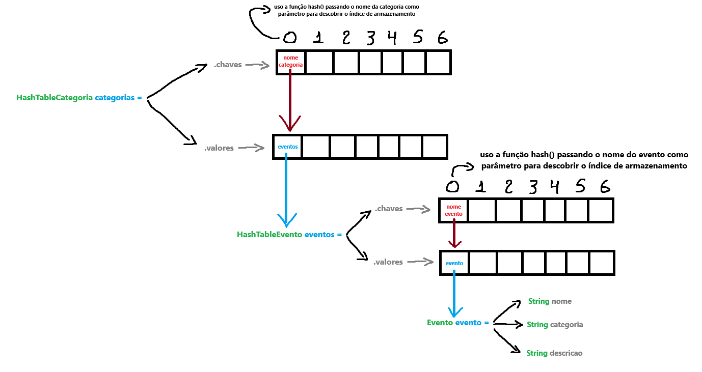

# Miniprojeto para Disciplina de Estrutura de Dados: 

## Sistema de Gerenciamento de Eventos com HashMap 

### Objetivo

Criar um sistema que permita o gerenciamento de eventos organizados por categorias, utilizando uma estrutura de hash map para otimizar a busca e recuperação dos eventos. 

#### Funcionalidades

* Inserir Evento: O usuário pode inserir um novo evento, especificando a categoria do evento, o nome do evento e sua descrição.

* Remover Evento: O usuário pode remover um evento existente, informando a categoria e o nome do evento.

* Buscar Eventos por Categoria: O usuário pode visualizar todos os eventos de uma determinada categoria.

* Listar Todas as Categorias: O usuário pode listar todas as categorias de eventos disponíveis.

#### Implementação 

* Hash Map para Armazenamento: Implemente uma tabela hash onde a chave será a categoria do evento e o valor será uma lista de eventos para essa categoria. 

* Operações de Inserção e Remoção: Para inserção, calcule o hash da categoria e insira o evento na lista correspondente. 

* Para remoção, encontre a categoria na tabela hash e remova o evento da lista. 

* Operação de Busca por Categoria: Calcule o hash da categoria e acesse a lista correspondente para obter todos os eventos relacionados àquela categoria. 

* Operação de Listagem de Categorias: Percorra a tabela hash e liste todas as categorias disponíveis. 

* Redimensionamento da tabela hash: quando o fator de carga da tabela hash hash estiver entre 0,7 e 0,8, realize o redimensionamento da tabela que envolve aumentar o tamanho da tabela hash para um novo tamanho apropriado ( número primo próximo ao dobro do tamanho original) e todos os elementos precisam ser rehashing e inseridos na nova tabela.

## Integrantes da Equipe

* [Ana Larissa dos Santos Gomes da Silva](https://github.com/Analarie)
* [Maelton Lima dos Santos](https://github.com/Maelton-SI)

## Solução de Armazenamento Adotada

<br>



## Conteúdos Consultados

* [*Como funciona a implementação de tabelas hash?*](https://pt.stackoverflow.com/questions/27827/como-funciona-a-implementa%C3%A7%C3%A3o-de-tabelas-hash)

* [*Função isPrime() utilizada.*](https://pt.stackoverflow.com/questions/264970/bibliotecas-em-python-para-checar-se-um-n%C3%BAmero-%C3%A9-primo)

    **Função original:**
    ```
    import math

    def isPrime(n):
        start = 2;

        while start <= math.sqrt(n):
            if n % start < 1:
                return False;
            start += 1;

        return n > 1;
    ```

    **Alterada para:**
    ```
    def eh_primo(numero):
        comeco = 2

        while comeco <= numero**(1/2):
            if numero % comeco < 1:
                return False
            comeco += 1

        return numero > 1
    ```